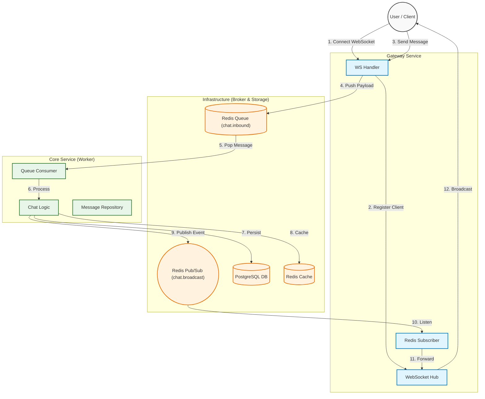

## 📂 Project Structure

```bash
chatty-project/
├── cmd/                            # Main entry points for the applications
│   ├── gateway/
│   │   └── main.go                 # Entry point for HTTP/WebSocket Gateway Service
│   └── core/
│       └── main.go                 # Entry point for Core Worker Service
│
├── internal/                       # Private application code (Clean Architecture)
│   ├── adapter/                    # Infrastructure implementations
│   │   ├── postgres/               # PostgreSQL connection & driver config
│   │   └── redis/                  # Redis client wrapper & implementation
│   │
│   ├── core/                       # Pure Business Logic (Use Cases)
│   │   ├── auth_logic.go           # Logic for Register, Login, Recovery
│   │   └── chat_logic.go           # Logic for Message Processing & History
│   │
│   ├── port/                       # Interfaces (Hexagonal Architecture)
│   │   └── broker.go               # Interface for MessageBroker (decouples Redis)
│   │
│   ├── repository/                 # Data Access Layer (Interfaces & Implementations)
│   │   ├── message_repo.go         # Methods to save/load messages
│   │   └── user_repo.go            # Methods to manage users
│   │
│   ├── service/                    # Domain Services (Stateless utilities)
│   │   └── sanitizer.go            # XSS Protection & Input Cleaning
│   │
│   └── crypto/                     # Cryptographic utilities
│       └── utils.go                # Password hashing, Key generation, Mnemonic
│
├── srv/                            # Service-specific layers (Interface Adapters)
│   └── gateway/
│       ├── dto/                    # Data Transfer Objects (Request/Response models)
│       ├── handler/                # HTTP Controllers & WebSocket Handlers
│       ├── middleware/             # Gin Middleware (e.g., JWT Auth)
│       ├── worker/                 # Background workers inside Gateway (Subscriber)
│       ├── ws/                     # WebSocket Hub & Client management
│       └── router.go               # API Route definitions
│
├── pkg/                            # Public shared libraries (Utils)
│   ├── api/                        # Standardized JSON response helpers
│   ├── auth/                       # JWT Token generation & validation
│   ├── consts/                     # Global constants (Error messages, Topic names)
│   ├── logger/                     # Structured Logging setup (Logrus)
│   └── validator/                  # Input validation logic
│
├── types/                          # Domain Entities (Structs matching DB tables)
│   ├── message.go
│   └── user.go
│
├── scripts/                        # Database scripts
│   └── init.sql                    # SQL tables initialization
│
├── Dockerfile.gateway              # Docker build instructions for Gateway
├── Dockerfile.core                 # Docker build instructions for Core
├── docker-compose.yml              # Orchestration for all services
├── go.mod                          # Go module definition
└── makefile                        # Shortcuts for running/building
```

## 🏗 Architecture & Data Flow

The following diagram illustrates how the **Gateway** handles connections and how the **Core** processes business logic asynchronously.



## 💿 Installation & Setup
### Docker (Recommended) 🐳

This method automatically sets up all dependencies (PostgreSQL, Redis, Gateway, Core) in isolated containers.

**Prerequisites:**
* [Docker](https://docs.docker.com/get-docker/)
* [Docker Compose](https://docs.docker.com/compose/install/)

**Steps:**

1.  **Clone the repository:**
    ```bash
    git clone [https://github.com/rezaafallah/chatty-project.git](https://github.com/rezaafallah/chatty-project.git)
    cd chatty-project
    ```

2.  **Setup Docker Drivers (Run once):**
    This project uses Loki for centralized logging. You must install the Docker plugin first.
    ```bash
    make setup-loki
    # OR manually:
    docker plugin install grafana/loki-docker-driver:latest --alias loki --grant-all-permissions
    ```
    
4.  **Build and Start Services:**
    You can use the `make` command or docker-compose directly.
    ```bash
    make up
    # OR
    docker-compose up --build -d
    ```

5.  **Verify Installation:**
    Check if containers are up and running:
    ```bash
    docker ps
    ```
    ✅ **Expected Output:** You should see 4 containers running: `chatty_gateway`, `chatty_core`, `chatty_db`, and `chatty_redis`.

6.  **Stop Services:**
    ```bash
    make down
    ```

---
